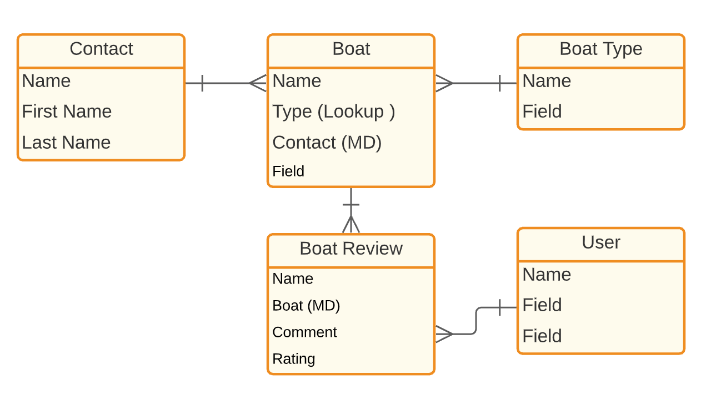
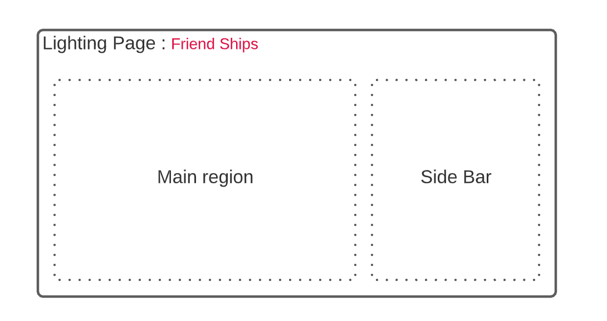
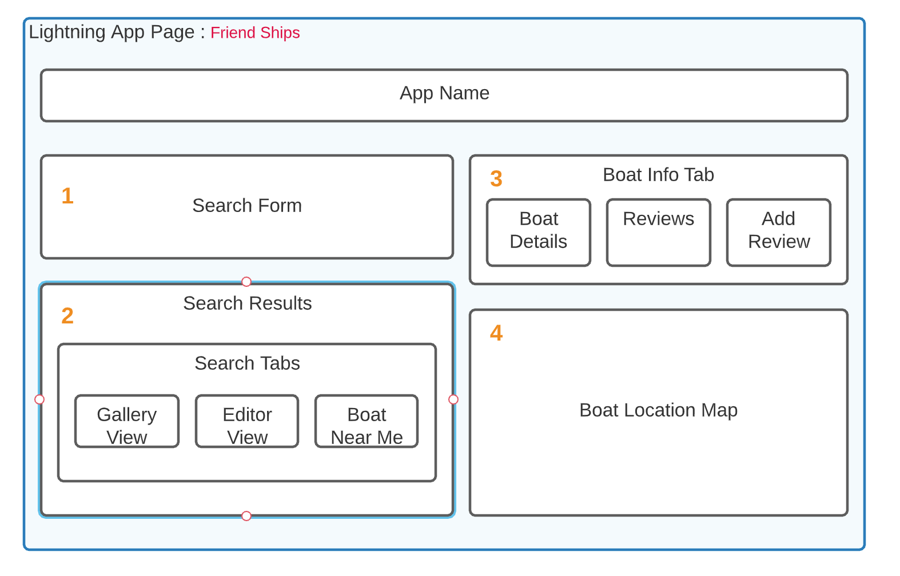

# Lightning Web Components (LWC) Superbadge

##What You'll Be Doing to Earn This Superbadge
Use Salesforce Lightning Design System (SLDS) in functional Lightning web components.
Convert Visualforce pages into a solution using Lightning Web Components.
Surface Lightning web components in Lightning App Builder, Lightning Experience, and a Lightning application.
Empower Admins to configure your custom components.
Create and invoke Apex methods to read data from custom objects.
Use component events and public methods to enable communication between tightly coupled components.
Enable communication between loosely coupled components.
Use Lightning Data Service to read and write custom object data.
Customize and use external JavaScript in a Lightning web component.
Troubleshoot your JavaScript code.
Describe how to test Lightning Web Components.
Import, export, and extend modules.

ß### Bonuse learnings 
Development with Scratch orgs.
Seperation of Concern (SOC) Design Patterns
Unlock Packages
Deployments via GitHub Actions  

##Concepts Tested in This Superbadge
Developing Lightning Web Components for use in Lightning App Builder
Using Lightning Data Service
Using JavaScript to handle user interactions
Troubleshooting components
Showing and hiding UX controls dynamically
Reading and writing custom object data
Communicating between components
Using native Salesforce functionality
Using external JavaScript in a Lightning web component

## Pre-work and Notes
1.  To see your changes right after you deploy your code, without delays caused by component cache, enabled below setting.
In the Setup > Security > Session Settings section, disable the component cache by deactivating the setting for Enable secure and persistent browser caching to improve performance.

2. Install this unlocked package (04t6g000008ateoAAA). 
  /packaging/installPackage.apexp?p0=04t6g000008ateoAAA.
This package contains all schema and initial code for your Lightning web components and for any Apex logic needed to complete this challenge. You won’t need to make any changes to the data schema.

## Business Requirements

The HowWeRoll company’s leadership has decided to expand beyond its core RV market and enter the recreational boating industry, as surveys have shown that a large share of RV travelers are also boat owners. 
Instead of investing in boats of its own, HowWeRoll plans to start a boat-sharing program where the company acts as a leasing agent for its customers’ boats. HowWeRoll is calling this new service Friend Ships.

1. Develop a custom search engine so HowWeRoll’s sales associates can dynamically filter the boats based on boat type (such as a fishing boat, pleasure boat, party boat) in order to match customer requests with the boating inventory. 

2. create a map that displays up to 10 boats based on the current user’s location.

3. Show similar boats based on the search 

## Standard Objects

* Contact — Organization contacts and boat owners.
* User — The people posting boat reviews and comments.

## Custom Objects

* Boat — Information about the boats that are owned by your contacts. This object contains a geolocation field so that you can plot its typical dock location on a map. This object has a master-detail relationship with the Contact standard object and a lookup relationship with BoatType.
* Boat Type — A list of the different types of boats, such as fishing boat, powerboat, sailboat, or party barge.
* BoatReview — Comments on and ratings of boats. This object has a master-detail relationship with Boat. So one boat can have many comments/ratings.

## Data Model

## Component Design 
#### Lightning App Page

#### Lightning App Composistion Design

### Project References
Github Repository : https://github.com/prishanf/lwc-superbadge
Github Project : https://github.com/prishanf/lwc-superbadge/projects/1
Salesforce DevOrg : https://cunning-shark-a6jnia-dev-ed--th-con-app.visualforce.com/ (My Community Playground)